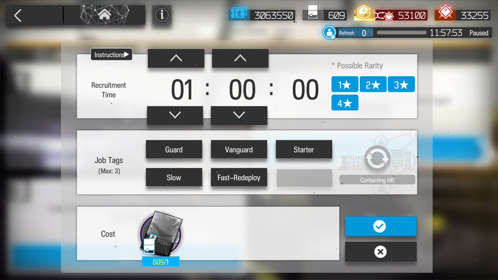

# Recruitment Bot

This is an automated recruitment bot that performs recruitment targetting an operator specified by the user. It is helpful for using expedited plans to target specific robots or five star operators.

It connects with an emulator via adb and uses OCR to determine the optimal tags for the character, and inputs them in before expediting.

## Features
- Automates recruitment tasks based on tags and priorities.
- Automatically stops recruitment if a six star or five star operator is detected
- (Optional) Automatically prioritizes four star guarantees for yellow certificates if the primary operator's rarity cannot be guaranteed, or or stops recruitment if the Robot tag is detected. Specified by user preferences.

## Requirements
- Python 3.x
- Libraries: `numpy`, `opencv-python`, `pytesseract`
- Emulator with open adb connection

## Usage

### User Specifications
Specify the user preferences in preferences_gen.py. 
1. You enter in the primary operator prioritized. 

	A. Can specify whether or not to prioritize four star tags if the operator's rarity cannot be guaranteed.
	B. Can specify whether or not to stop the program if the "robot" tag is found.
	C. Can specify a secondary target if no tags for the primary target is found.

2. Run preferences_gen.py. It will search for the specified name in the recruitment database, and display the tags. If you are satisfied with this, proceed to main.py

### Running the bot
1. Navigate to the following window on the **top left recruitment slot** of an arknights emulator at **resolution 1920x1080**.
	
	A. If you are not at this resolution, you will need to customize parameters for image recognition, found in main.py and in tagbuttons.txt (which outlines the location of tags, used for ocr).

2. **Run the bot** using the python script main.py

3. The bot will automatically detect tags, calculate the optimal tags for the prioritized operator, click the tags, select the appropriate timer, hit confirm, and expedite. It will take screenshots which will be deleted afterwards.
	
	A. If a six star, five star, or one star operator can be guaranteed, the bot stops after displaying possible options, allowing the user to pick the tags specifically

## Customization
You can adjust your preferences by editing preferences_gen.py and generating a new preferences.json.
- **primary_target**: The name of the main operator to be targeted
- **stop_on_robot_tag**: Set this to `true` to stop the bot if the "Robot" tag is found.
- **target_priority_over_four_star**: If true, then ignore 4 star guarantees in hopes of prioritizing the main target. If false, then if there is no guarantee for the rarity of the main target, try a 4 star tag to obtain yellow certificates.

### Safety

To avoid automated detection, this bot clicks at slightly random positions with randomly determined times (drawn from a gaussian distribution). If you are worried about being automatically detected, you can increase the time between clicks in main.py

### Alternative Window Sizes

If you are not using the standard screen resolution, you will need to adjust the positions of buttons in main.py. You will also need to generate new tag positions, which are normally found in tagbuttons.txt. Example code for generating new tag positions are found in the tag_positions folder.

### Updating Recruitment

Folder recruit_data_gen contains code used to generate recruitment_database.json, which is the database this program uses to calculate recruitments. If you want to update the list of recruitable operators, use the programs in this folder.

## File Structure

- main.py is the main program that runs the bot. 
- preferences_gen.py is the program that generates a preferences.json used to prioritize recruitments
- recruit_calc.py calculates the optional recruitment and uses the preferences to select tags. You can uncomment the code here and send in custom tags to verify the program works for your purposes.
- tag_ocr.py retrieves text for the tags from the screenshots
- folders tag_positions and recruit_data_gen are used for generating the positions of tags (tagbuttons.txt) and the recruitment_database.json (used to calculate recruitments).

## License
MIT License